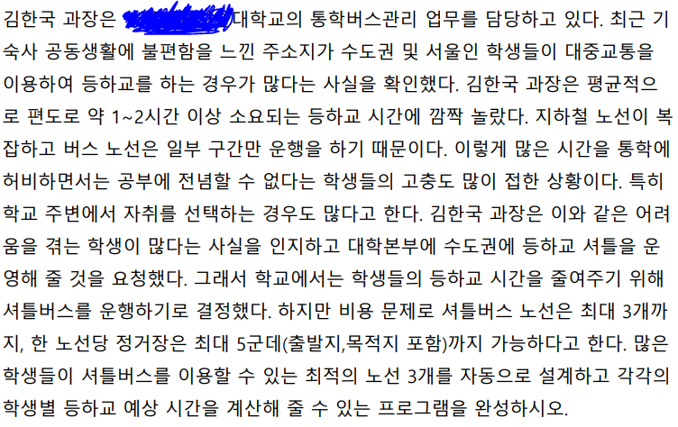
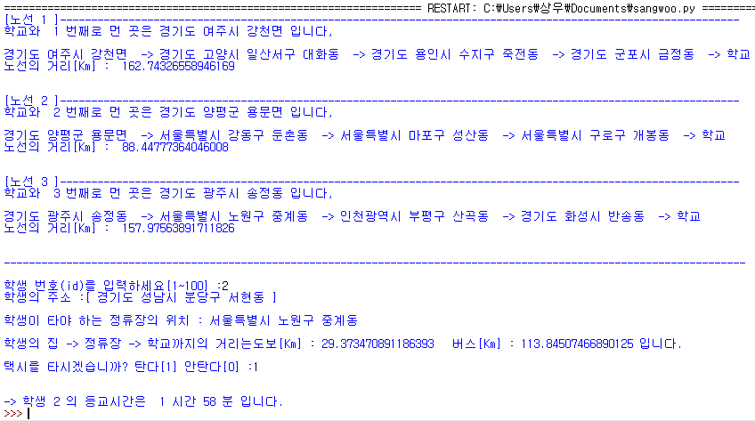

# 버스노선

100개의 학생 주소를 엑셀파일을 통해 받고, 받은 주소로 학교까지의 최적의 버스노선을 3개 찾는 프로젝트입니다.

Python 으로 엑셀파일을 읽고 쓰기위해 xlwings와 pandas를 사용합니다.

100개의 한글 주소는 지도상의 위도와 경도로 바꿔서 거리계산을 해야하므로 한글주소를 위,경도로 바꾸는 api가 필요합니다
---> google geocoder 를 사용.

## Process

1.  100개의 한글주소를 받고 google-geocoder를 사용해 위도 경도로 바꿉니다.

2.  정류장을 학교포함 5개씩 3개로 만들기 위해 100명을 학교제외 군집단 12개로 나눈다 [k평균 알고리즘]

3.  13개의 정류장 사이의 거리를 가중치로 하여 학교까지의 최단거리, 최단경로를 구한다 [다익스트라 알고리즘]

4.  다익스트라 알고리즘을 통해 구한 노선 3개가 5 / 5 / 5 개가 된다면, n번으로 넘어가고 되지 않는다면  
    5 / 5 / 5 개의 노선을 만들기 위한 알고리즘 실행한다.

    [노선 3개를 5 / 5 / 5 개로 만들기 위한 알고리즘]
    예를들어 노선이 a - b - d - e 라고 하자. 3개의 만들어진 노선을 제외한 나머지 정류장들을 하나의 배열에 넣고,

    그 배열의 원소와 초기에 5개로 만들어지지 않은 노선의 정류장들 모두와 거리를 비교한다. 그중 거리가 가장 짧은

    원소를 찾아야한다. 예를들어 위 노선에서 포함되지 않는 정류장은 c 라고 가정하고, c와 제일 거리가 가까운 정류장은

    b라고 해보자. 그럼 최소거리를 위해 c가 들어갈 수 있는 위치는 b의 앞뒤이다. 여기서, c는 최적의 노선설계를 위해

    b의 앞과 뒤인 a와 d와의 거리를 각각 구한다. 그 두 거리를 비교해서 더욱 가까운쪽이 c가 들어갈 수 있는 최적의

    자리인 것이다. 이렇게 해서 총 5개의 정류장을 통하는 1개의 노선을 구했다. 이 과정을 모든 배열의 원소와 3개의 루트

    에 적용시키면 총 5 / 5 / 5 개의 정류장이 나온다.

     

5.  3개의 노선을 구했으면 100명의 학생 중 한명의 이름[or ID]를 받는다.

6.  그 학생의 좌표값과 모든 정류장의 위치를 비교해 가장 가까운 정류장을 찾는다.

7.  학생과 정류장까지의 거리와 정류장으로부터 학교까지의 거리를 더하면 총 [도보/버스] 거리가 나오고, 시간을 계산할 수 있다.

    [학생의 도보거리가 너무 길 경우]

    - 택시 기능을 추가시켜 시간을 단축 시킨다.

    - 버스(70Km/h), 택시(80Km/h), 도보(4Km/h) 로 계산해 시간을 구한다.
       

8.  만일 학생이 첫 정류장이 아닌 중간의 어느 한 정류장과 제일 가까울 경우?

    - 학생과 가장 가까운 정류장 전의 노선의 거리를 제외시킨 거리를 구해야 한다.

    [중간에 껴있는 정류장에서 탑승한 학생의 거리를 구하는 알고리즘]

    학생 1이 있고, 노선은 [a - b - c - d - 학교] 이고 학생1은 c정류장에서 타야한다고 가정하자. 그럼 학생의 총 도보거리는

    학생의 좌표로부터 c까지의 거리이고 총 버스길이는 버스노선의 총 길이에서 a -> b 와 b -> c의 거리를 뺀 거리가 된다.
      

9.  모든 과정이 끝난다면 학생이 학교까지 가는 총 시간을 보여주고 도보와 버스, 택시 각각의 소요시간을 보여준다.

## 동작 사진

## 1. problem

## 2.result

